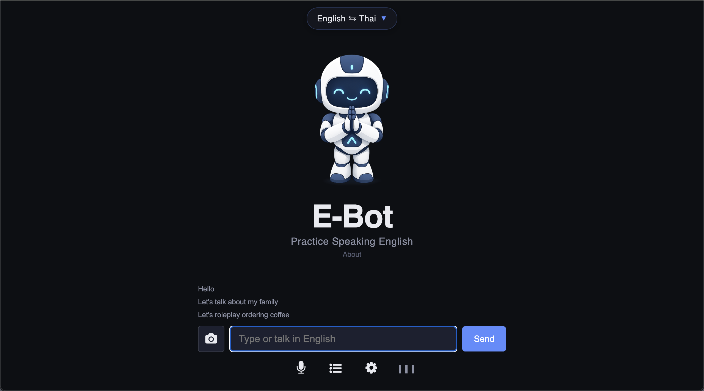
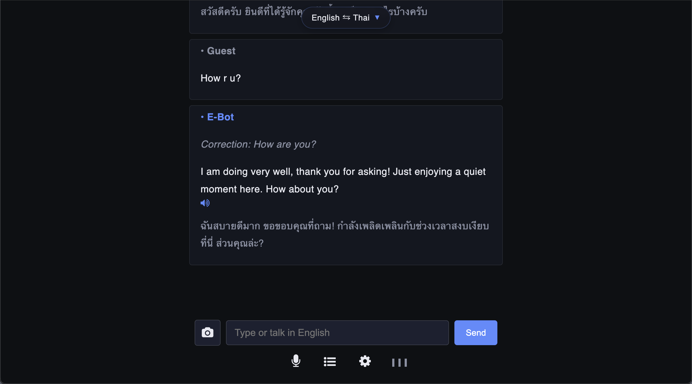
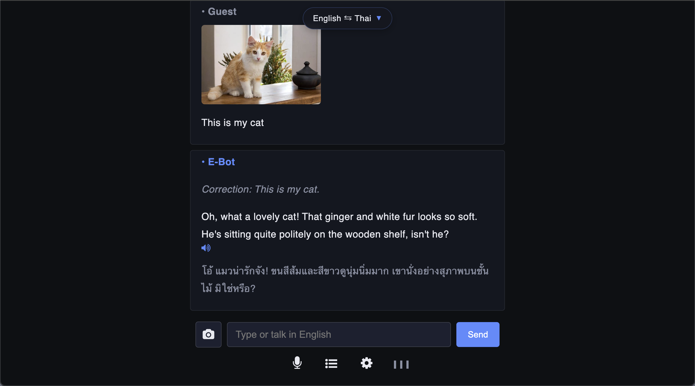
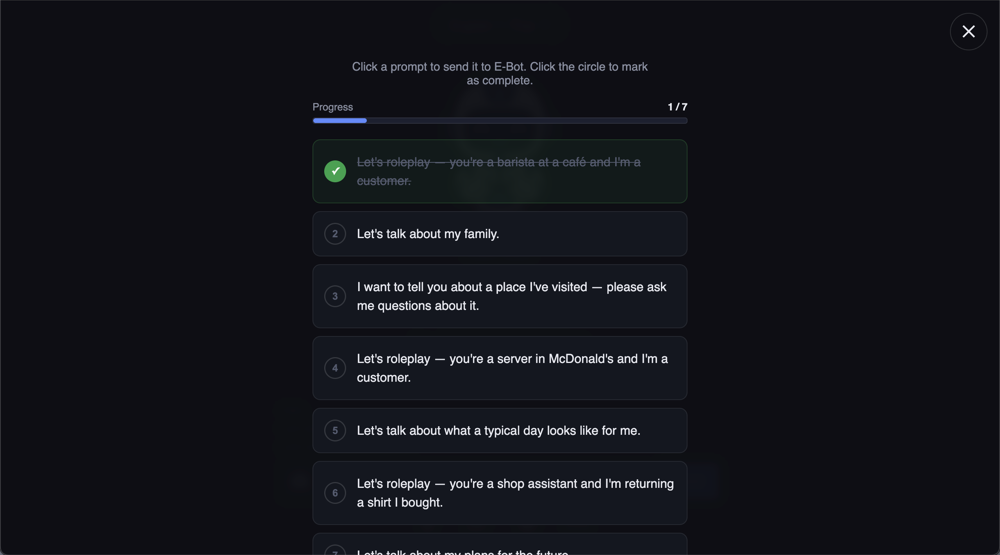

# E-Bot English Practice Chatbot - 2026

Live Demo - 2026 version: 
  
https://ebot2026.woza.work/

E-Bot is a chatbot for practicing spoken English. There's no fixed course or lesson plan. You just talk naturally and E-Bot responds with both text and voice.

Many learners know English grammar rules, but find it hard to get real-world conversation practice. Also, many are shy or anxious about making mistakes in front of others.

E-Bot tries to solve these problems by providing a patient, private and low-stress way to practice English conversation on a phone or on a desktop computer.

No account needed. Just go to the website and start talking.

 

Dark mode

 

Correction and translation

 

Supports images

 

Ready-made exercises

 

## Quick Info
- Mobile optimized web app
- Supports both voice and text
- Supports images e.g. upload a photo of a menu and roleplay ordering from it.
- Translates English responses into the user's native language. Supports 86 languages.
- Corrects the user's spelling and grammar errors without disturbing the conversation flow.
- Click any response to replay the audio
- Minimalist UI design with light and dark modes
- Frontend: Html, CSS, Javascript
- Backend: PHP
- Uses the OpenRouter API (qwen3.5-flash-02-23 by Alibaba)
- Set up as a three-agent LLM system - chat, correction, translation
- Uses Javascript SpeechRecognition to convert the user's speech into text
- Uses Javascript SpeechSynthesis to convert text to speech
- Has visual audio cues for deaf learners
- Can be rebranded and self-hosted on any shared hosting platform

  

## Deployment Notes

- Add your OpenRouter API key to the ebot_config.ini.txt file before uploading to your web host server.
- Change the name of the file to ebot_config.ini
- For added security it's best to locate the ebot_config.ini file outside the web host root folder.

 

## Notes
- This solution needs to be validated. The pain point exists, but does this approach effectively solve it for users who are highly motivated English learners?
- This app needs to be beta tested by non-english speakers under real world conditions e.g. using their own mobile devices.
- Need to test how well the STT system handles accented English and non-standard English pronounciations e.g. mo-char versus mo-car (coffee)
- The API cost needs to be monitored.
- The voice quality on mobile (Android) is much better than that on desktop.
- The voice type and gender will vary across devices and across operating systems. This will be an issue with languages that have gender specific ways of speaking e.g. Thai.
- The app is non-profit with no ads, but it depends on a paid third-party AI model. Therefore, it's not clear how API costs and hosting costs will be covered as usage grows.
 

## Revision History

Version 3.0 
28-July-2026 
Released for beta testing.

 
